```python
import numpy as np
import os
import matplotlib.pyplot as plt
import math
import scipy.stats as stats
import scipy
%matplotlib inline
```


```python
def plot_pdf(u_arr, sigma_arr):
    x = np.linspace(-1, 3, 1000)
    plt.rcParams['figure.figsize']=(9,3)
    
    for mu, s in zip(u_arr, sigma_arr):
        plt.plot(x, stats.norm.pdf(x, mu, s))
    
    
    

def plot_points(points, R=np.nan):
    if (np.isnan(R).any()):
        plt.scatter(points, np.zeros((points.shape[0])), color='black', s=12, marker='o')
    else:
        for i, point in enumerate(points):
            if R[i,0] < R[i,1]:
                col = 'orange'
            else:
                col = 'blue'
            plt.scatter(point, np.zeros((1)), color=col, s=12, marker='o')
            
    
```


```python
def E_step(x_arr, pi_arr, u_arr, sigma_arr):
    
    N1 = scipy.stats.norm(u_arr[0], sigma_arr[0])
    N2 = scipy.stats.norm(u_arr[1], sigma_arr[1])

    R = np.empty((x_arr.shape[0],2))

    for i, point in enumerate(x_arr):
        R[i,0] = pi_arr[0]*N1.pdf(x_arr[i]) / ( pi_arr[0]*N1.pdf(x_arr[i])+pi_arr[1]*N2.pdf(x_arr[i]) )
        R[i,1] = pi_arr[1]*N2.pdf(x_arr[i]) / ( pi_arr[0]*N1.pdf(x_arr[i])+pi_arr[1]*N2.pdf(x_arr[i]) )
    
    return R


def M_step(x_arr, R):
    pi = np.average(R, axis=0)
    
    u = np.empty(2)
    for i in range(2):
        u[i] = np.dot(R[:,i],x_arr) / np.sum(R[:,i])

    sigma = np.empty(2)
    for i in range(2):
        sigma[i] = np.dot(R[:,i],(x_arr-u[i])**2) / np.sum(R[:,i])
        
    return pi, u, sigma


```


```python
def get_log_likelihood(x_arr, u_arr, sigma_arr, pi_arr):
    N1 = scipy.stats.norm(u_arr[0], sigma_arr[0])
    N2 = scipy.stats.norm(u_arr[1], sigma_arr[1])
    
    log_likelihood = 0
    for i, point in enumerate(x_arr):
        log_likelihood += np.log(pi_arr[0]*N1.pdf(x_arr[i])+pi_arr[1]*N2.pdf(x_arr[i]))
        
    return log_likelihood
```


```python
def get_lower_bound(x_arr, u_arr, sigma_arr, pi_arr, R):
    N1 = scipy.stats.norm(u_arr[0], sigma_arr[0])
    N2 = scipy.stats.norm(u_arr[1], sigma_arr[1])
    
    log_likelihood = np.empty(100)
    for i, point in enumerate(x_arr):
        #log_likelihood += np.log(pi_arr[0]*N1.pdf(x_arr[i])+pi_arr[1]*N2.pdf(x_arr[i]))
        if (R[i,1]<0.0001):
            log_likelihood += R[i,0]*np.log(pi_arr[0]*N1.pdf(x_arr[i])/R[i,0]) 
        elif (R[i,0]<0.0001):
            log_likelihood += R[i,1]*np.log(pi_arr[1]*N2.pdf(x_arr[i])/R[i,1] ) 
        else:
            log_likelihood += R[i,0]*np.log(pi_arr[0]*N1.pdf(x_arr[i])/R[i,0]) + R[i,1]*np.log(pi_arr[1]*N2.pdf(x_arr[i])/R[i,1] )
        
    return log_likelihood
```


```python
x1 = np.random.normal(size = 10, loc = 0, scale = 0.2)
x2 = np.random.normal(size = 10, loc = 2, scale = 0.1) # loc - mean, var - std
#x1 ~ Norm(0, 0.04)
#x2 ~ Norm(2, 0.01)
```


```python
x = np.concatenate((x1,x2))
x
```


    array([ 0.20623019,  0.09603255, -0.07236562,  0.00854076,  0.17623993,
            0.10802832,  0.24905574,  0.23652601,  0.15899008, -0.27409902,
            2.11829573,  1.95504857,  1.89271833,  1.9221238 ,  2.10080868,
            1.93473177,  1.9433289 ,  2.01570425,  1.90885912,  2.00429442])


```python
plt.rcParams['figure.figsize']=(12,3)
plot_points(x)
```


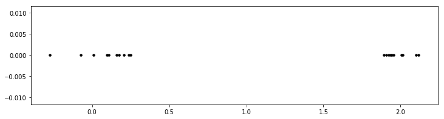


```python
# random mean (mu) and std (sigma)
mu1 = np.random.rand(1)/4 + 2
mu2 = np.random.rand(1)/4 + 2
sigma1 = sigma2 = 0.1

u = np.array([mu1, mu2])
u_old = u[0]
sigma = np.array([sigma1, sigma2])
pi = np.array([0.5, 0.5])
```


```python
plot_pdf(u, sigma)
plot_points(x)
```


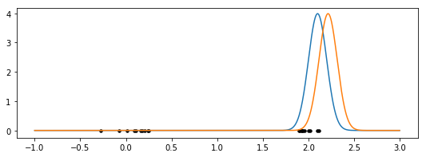


```python
responsibilities = E_step(x, pi, u, sigma)
```


```python
responsibilities
```


    array([[1.00000000e+00, 1.86739247e-10],
           [1.00000000e+00, 5.27341937e-11],
           [1.00000000e+00, 7.63696345e-12],
           [1.00000000e+00, 1.93240478e-11],
           [1.00000000e+00, 1.32369031e-10],
           [1.00000000e+00, 6.05160139e-11],
           [1.00000000e+00, 3.05243482e-10],
           [1.00000000e+00, 2.64367152e-10],
           [1.00000000e+00, 1.08599028e-10],
           [1.00000000e+00, 7.54451065e-13],
           [6.13381395e-01, 3.86618605e-01],
           [9.11711002e-01, 8.82889978e-02],
           [9.54778563e-01, 4.52214366e-02],
           [9.37760150e-01, 6.22398499e-02],
           [6.59754695e-01, 3.40245305e-01],
           [9.28762265e-01, 7.12377347e-02],
           [9.21953031e-01, 7.80469695e-02],
           [8.37360888e-01, 1.62639112e-01],
           [9.46073728e-01, 5.39262718e-02],
           [8.54413170e-01, 1.45586830e-01]])


```python
plot_pdf(u, sigma)
plot_points(x, responsibilities)
```


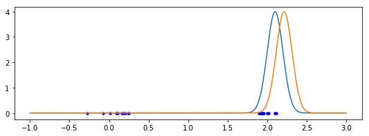


```python
pi, u, sigma = M_step(x, responsibilities)
```


```python
plot_pdf(u, sigma)
plot_points(x)
```


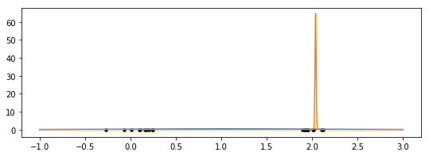


```python
# random mean (mu) and std (sigma)
x1 = np.random.normal(size = 50, loc = 0, scale = 0.4)
x2 = np.random.normal(size = 50, loc = 2, scale = 0.2) # loc - mean, var - std
#x1 ~ Norm(0, 0.04)
#x2 ~ Norm(2, 0.01)
x = np.concatenate((x1,x2))


mu1 = np.random.rand(1)/4 
mu2 = np.random.rand(1)/4 + 1
sigma1 = sigma2 = 0.2

u = np.array([mu1, mu2])
u_old = u[0]
sigma = np.array([sigma1, sigma2])
pi = np.array([0.5, 0.5])
```


```python
for i in range(10):
    print("\n Iterration ", i)
    #plot_pdf(u, sigma)
    #plot_points(x_arr)
    #plt.show()
    mu = np.linspace(1, 4, 100)
    #plt.plot(mu, get_log_likelihood(x, np.array((u_old[0], mu)), sigma, pi))
    #if (i>0):
        #print('u_old=',u_old,' u_new=', u[0])
        #plt.plot(mu, get_lower_bound(x, np.array((u_old[0], mu)), sigma, pi, responsibilities))
    #plt.plot(mu, get_lower_bound(x, np.array((u[0], mu)), sigma, pi, responsibilities))
    #plt.title('Maximizing lower bound')
    plt.show()
    
    responsibilities_old = responsibilities
    
    responsibilities = E_step(x, pi, u, sigma)
    log_l = get_log_likelihood(x, u, sigma, pi)
    print("E-step: assigned responsibilities")
    print('log-likelihood= ',log_l)
    plot_pdf(u, sigma)
    plot_points(x, responsibilities)
    plt.show()
    
    u_old = u
    sigma_old = sigma
    pi_old = pi
    pi, u, sigma = M_step(x, responsibilities)
    print("M-step: changed Gaussians")
    print('pi= ', pi)
    plot_pdf(u, sigma)
    plot_points(x)
    plt.show()
```

    
     Iterration  0
    E-step: assigned responsibilities
    log-likelihood=  [-520.47697969]


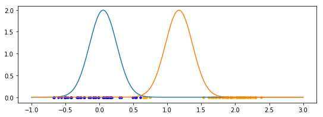


    M-step: changed Gaussians
    pi=  [0.45099529 0.54900471]


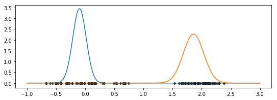


    
     Iterration  1
    E-step: assigned responsibilities
    log-likelihood=  -306.8067167134023


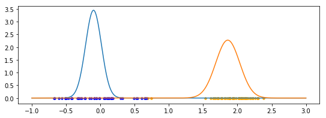


    M-step: changed Gaussians
    pi=  [0.47837828 0.52162172]


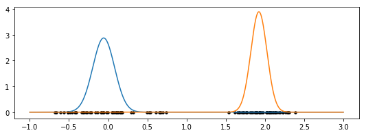


    
     Iterration  2
    E-step: assigned responsibilities
    log-likelihood=  -257.13513877646795


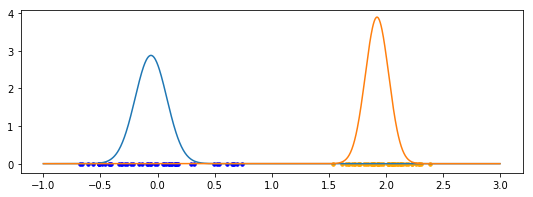


    M-step: changed Gaussians
    pi=  [0.5 0.5]


    
     Iterration  3
    E-step: assigned responsibilities
    log-likelihood=  -675.9448654471817


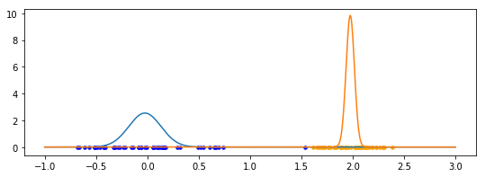


    M-step: changed Gaussians
    pi=  [0.50999696 0.49000304]


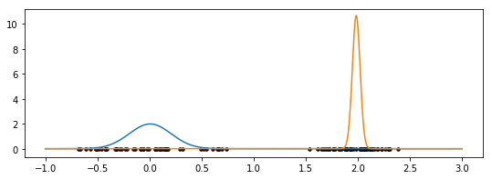


    
     Iterration  4
    E-step: assigned responsibilities
    log-likelihood=  -679.6279485007526


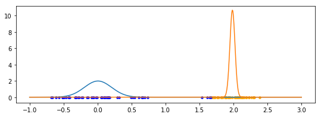


    M-step: changed Gaussians
    pi=  [0.5358041 0.4641959]


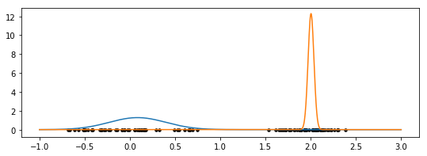


    
     Iterration  5
    E-step: assigned responsibilities
    log-likelihood=  -500.4485515126519


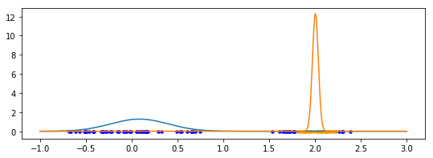


    M-step: changed Gaussians
    pi=  [0.66831039 0.33168961]


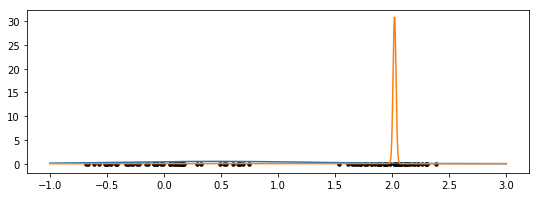


    
     Iterration  6
    E-step: assigned responsibilities
    log-likelihood=  -185.16729392562996


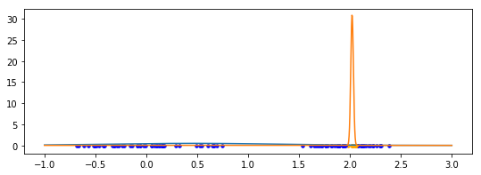


    M-step: changed Gaussians
    pi=  [0.92347917 0.07652083]


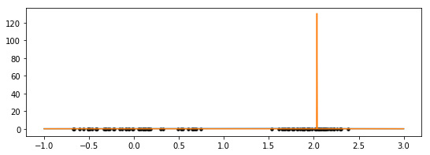


    
     Iterration  7
    E-step: assigned responsibilities
    log-likelihood=  -154.98181279668455


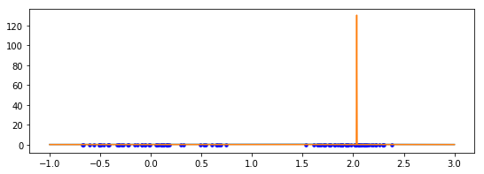


    M-step: changed Gaussians
    pi=  [9.99595551e-01 4.04449156e-04]


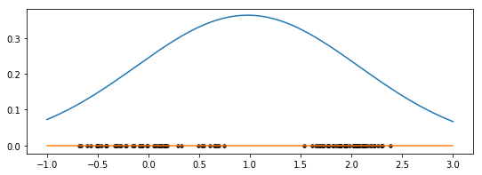


    
     Iterration  8
    E-step: assigned responsibilities
    log-likelihood=  7.761554006590991


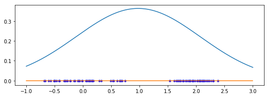


    M-step: changed Gaussians
    pi=  [0.99 0.01]


    /Users/VorobievaIrina/anaconda3/lib/python3.6/site-packages/scipy/stats/_distn_infrastructure.py:1720: RuntimeWarning: divide by zero encountered in true_divide
      x = np.asarray((x - loc)/scale, dtype=dtyp)


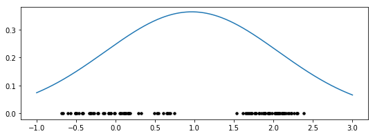


    
     Iterration  9


    /Users/VorobievaIrina/anaconda3/lib/python3.6/site-packages/scipy/stats/_distn_infrastructure.py:1720: RuntimeWarning: divide by zero encountered in double_scalars
      x = np.asarray((x - loc)/scale, dtype=dtyp)
    /Users/VorobievaIrina/anaconda3/lib/python3.6/site-packages/scipy/stats/_distn_infrastructure.py:1720: RuntimeWarning: invalid value encountered in double_scalars
      x = np.asarray((x - loc)/scale, dtype=dtyp)


    E-step: assigned responsibilities
    log-likelihood=  nan


    M-step: changed Gaussians
    pi=  [nan nan]


    /Users/VorobievaIrina/anaconda3/lib/python3.6/site-packages/scipy/stats/_distn_infrastructure.py:897: RuntimeWarning: invalid value encountered in greater_equal
      return (a <= x) & (x <= b)
    /Users/VorobievaIrina/anaconda3/lib/python3.6/site-packages/scipy/stats/_distn_infrastructure.py:897: RuntimeWarning: invalid value encountered in less_equal
      return (a <= x) & (x <= b)


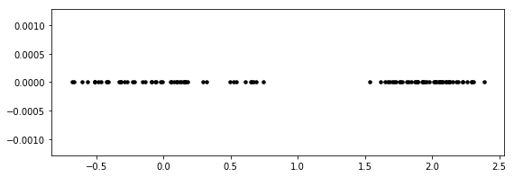


```python
# random mean (mu) and std (sigma)
x1 = np.random.normal(size = 50, loc = 0, scale = 0.4)
x2 = np.random.normal(size = 50, loc = 2, scale = 0.2) # loc - mean, var - std
```


```python
print(x1[:5])
print(x2[:5])
```

    [0.1199229  0.2231488  0.19311285 0.42303945 0.46889358]
    [1.94457782 1.95181124 1.80509404 2.0390942  2.11508475]


```python
x = np.concatenate((x1,x2))
```


```python
x
```


    array([ 1.19922903e-01,  2.23148795e-01,  1.93112852e-01,  4.23039449e-01,
            4.68893576e-01,  7.69596126e-03,  4.97331832e-01, -1.60536037e-01,
            7.84337162e-01, -1.73367309e-01,  2.65089074e-03, -1.63587185e-01,
           -1.69625125e-01,  3.47909172e-01,  2.68859515e-01, -3.45405366e-01,
           -5.88657312e-02,  4.15280739e-01,  5.74114396e-01, -4.66242466e-01,
            2.49937268e-04, -7.99016590e-02, -5.38457578e-02, -8.59263130e-01,
            2.03772644e-01,  1.07984314e-01, -1.96270751e-01,  4.66537363e-01,
            2.92530483e-01, -4.74300065e-01,  3.42143895e-01, -4.26843295e-01,
           -2.76012908e-01, -5.76389047e-01,  8.02208222e-01, -1.76540896e-02,
            2.47173369e-01, -4.46859666e-01, -1.21257185e-01, -2.95766556e-01,
            5.67126072e-01,  5.17555199e-01,  5.03177335e-01,  2.80178212e-01,
            3.60740121e-01,  1.92654641e-01, -1.82350372e-01,  8.04608626e-01,
           -3.06202490e-02,  4.59128329e-01,  1.94457782e+00,  1.95181124e+00,
            1.80509404e+00,  2.03909420e+00,  2.11508475e+00,  1.72968815e+00,
            1.76948565e+00,  2.01825909e+00,  2.06210116e+00,  2.31800213e+00,
            2.07209145e+00,  1.89007639e+00,  2.03649624e+00,  2.07405227e+00,
            1.82720349e+00,  2.15500829e+00,  2.20584005e+00,  2.03275138e+00,
            2.45103051e+00,  1.67726716e+00,  2.08639845e+00,  1.99417894e+00,
            1.65222863e+00,  1.72495911e+00,  1.72045952e+00,  2.24292527e+00,
            2.19306403e+00,  1.93947710e+00,  2.27841143e+00,  1.74440699e+00,
            2.03490255e+00,  1.85364577e+00,  2.24824005e+00,  2.21642375e+00,
            1.98276983e+00,  2.01565831e+00,  2.40178673e+00,  2.08354490e+00,
            2.21853544e+00,  1.67078846e+00,  1.93024606e+00,  1.95283404e+00,
            1.82340530e+00,  1.96389665e+00,  1.91564864e+00,  2.02317431e+00,
            1.99298270e+00,  1.73441373e+00,  2.06565548e+00,  1.89554981e+00])


```python
# let's try to visualize our original data
# since it's 1-D data, we'll do a scatter plot but plug in zeros for y values
plt.scatter(x, np.zeros((x.shape[0])), color='black', s=12, marker='o')
```


    <matplotlib.collections.PathCollection at 0x112ac8940>


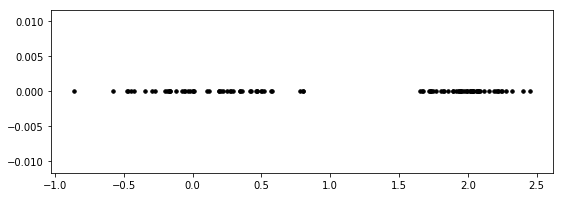


```python
mu1 = np.random.rand(1)/4 
mu2 = np.random.rand(1)/4 + 1
sigma1 = sigma2 = 0.2

u = np.array([mu1, mu2])
sigma = np.array([sigma1, sigma2])
pi = np.array([0.5, 0.5])
```


```python
# now let's plot our points together with initial Gaussians
points = np.linspace(-1, 3, 1000)
plt.rcParams['figure.figsize']=(9,3)

for mu, s in zip(u, sigma):
    plt.plot(points, stats.norm.pdf(points, mu, s))

plt.scatter(x, np.zeros((x.shape[0])), color='black', s=12, marker='o')
```


    <matplotlib.collections.PathCollection at 0x112b26748>


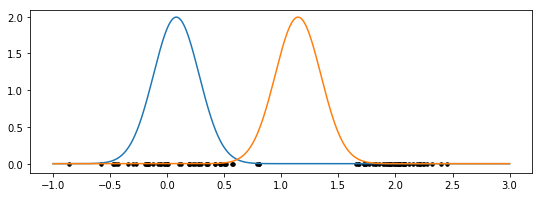


```python
# let's calculate data log-likelihood
N1 = scipy.stats.norm(u[0], sigma[0])
N2 = scipy.stats.norm(u[1], sigma[1])

log_likelihood = 0
for i, point in enumerate(x):
    log_likelihood += np.log(pi[0]*N1.pdf(x[i])+pi[1]*N2.pdf(x[i]))
    
print('log_likelihood = ', log_likelihood)
```

    log_likelihood =  [-546.82680207]


```python
# let's make it into function
def get_log_likelihood(x_arr, u_arr, sigma_arr, pi_arr):
    N1 = scipy.stats.norm(u_arr[0], sigma_arr[0])
    N2 = scipy.stats.norm(u_arr[1], sigma_arr[1])
    
    log_likelihood = 0
    for i, point in enumerate(x_arr):
        log_likelihood += np.log(pi_arr[0]*N1.pdf(x_arr[i])+pi_arr[1]*N2.pdf(x_arr[i]))
        
    return log_likelihood
```


```python
# let's try to visualize data log-likelihood 
# to get a 2D plot we'll fix all parameter to their current values
# except for u[1] (mean of the second Gaussian), which we will vary
mu = np.linspace(1, 4, 100)
plt.plot(mu, get_log_likelihood(x, np.array((u[0], mu)), sigma, pi))
plt.xlabel('2nd Gaussian mean')
plt.ylabel('Data log-likelihood')
```


    Text(0, 0.5, 'Data log-likelihood')


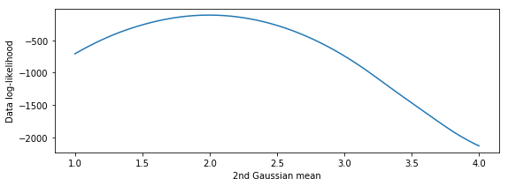


```python
# we can vary any other parameter as well
# let's try fixing everything except for sigma[0] (first Gaussian std)
s = np.linspace(0, 3, 100)
plt.plot(s, get_log_likelihood(x, u, np.array((s, sigma[1])), pi))
plt.xlabel('1st Gaussian std')
plt.ylabel('Data log-likelihood')
```

    /Users/VorobievaIrina/anaconda3/lib/python3.6/site-packages/scipy/stats/_distn_infrastructure.py:1720: RuntimeWarning: divide by zero encountered in true_divide
      x = np.asarray((x - loc)/scale, dtype=dtyp)


    Text(0, 0.5, 'Data log-likelihood')


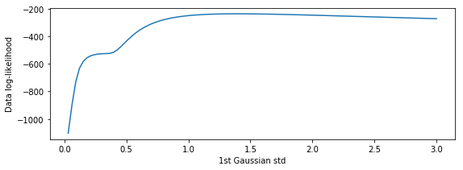


```python
# we can vary any other parameter as well
# let's try fixing everything except for sigma[0] (first Gaussian variance)
p = np.linspace(0, 1, 100)
plt.plot(p, get_log_likelihood(x, u, sigma, np.array((p, 1-p)) ))
plt.xlabel('1st Gaussian weight')
plt.ylabel('Data log-likelihood')
```


    Text(0, 0.5, 'Data log-likelihood')


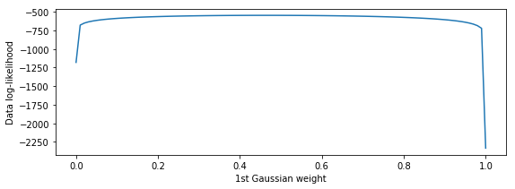


```python
# since we were only varying one parameter at a time
# it's very hard to find optimal values for all parameters by this method
```


```python
# let's perform series of EM updates
# here we do E-step: find responsibilities for each data point in x
N1 = scipy.stats.norm(u[0], sigma[0])
N2 = scipy.stats.norm(u[1], sigma[1])

R = np.empty((x.shape[0],2))

for i, point in enumerate(x):
    R[i,0] = pi[0]*N1.pdf(x[i]) / ( pi[0]*N1.pdf(x[i])+pi[1]*N2.pdf(x[i]) )
    R[i,1] = pi[1]*N2.pdf(x[i]) / ( pi[0]*N1.pdf(x[i])+pi[1]*N2.pdf(x[i]) )
```


```python
R[:5]
```


    array([[9.99998070e-01, 1.93006863e-06],
           [9.99969727e-01, 3.02726751e-05],
           [9.99986411e-01, 1.35894752e-05],
           [9.93786287e-01, 6.21371344e-03],
           [9.79203900e-01, 2.07961004e-02]])


```python
# two values of each point's responsibility vector show
# the probability of data point coming from one of two Gaussians
# to visualize how responsibilities were assigned,
# let's plot points in orange / blue depending on which value of their responsibility vector is higher
for i, point in enumerate(x):
    if R[i,0] < R[i,1]:
        col = 'orange'
    else:
        col = 'blue'
    plt.scatter(point, np.zeros((1)), color=col, s=12, marker='o')
    
# and let's plot our Gaussians as well
points = np.linspace(-1, 3, 1000)

for mu, s in zip(u, sigma):
    plt.plot(points, stats.norm.pdf(points, mu, s))
```


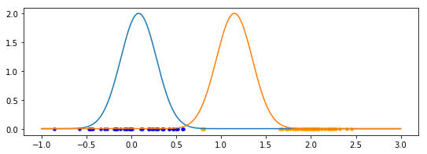


```python
# the picture above makes a lot of sense!
# point get colored based on which Gaussian is more likely 
# to produce it (i.e. which PDF is higher at that point)
```


```python
# now we are moving to M-step, where we update the parameters
# let's save old parameter values before update
u_old = u
sigma_old = sigma
pi_old = pi
```


```python
print("u_old =", u_old)
print("sigma_old =", sigma_old)
print("pi_old =", pi_old)
```

    u_old = [[0.08000243]
     [1.14667988]]
    sigma_old = [0.2 0.2]
    pi_old = [0.5 0.5]


```python
# now let's perform M-step: update parameter values 
# using responsibilities from E-step
pi = np.average(R, axis=0)
    
u = np.empty(2)
for i in range(2):
    u[i] = np.dot(R[:,i],x) / np.sum(R[:,i])

sigma = np.empty(2)
for i in range(2):
    sigma[i] = np.dot(R[:,i],(x-u[i])**2) / np.sum(R[:,i])
```


```python
print("u =", u)
print("sigma =", sigma)
print("pi =", pi)
```

    u = [0.04605771 1.90954782]
    sigma = [0.11591768 0.13470239]
    pi = [0.46300247 0.53699753]


```python
# let's plot our new Gaussians and points
points = np.linspace(-1, 3, 1000)
plt.rcParams['figure.figsize']=(9,3)

for mu, s in zip(u, sigma):
    plt.plot(points, stats.norm.pdf(points, mu, s))

plt.scatter(x, np.zeros((x.shape[0])), color='black', s=12, marker='o')
```


    <matplotlib.collections.PathCollection at 0x113058a20>


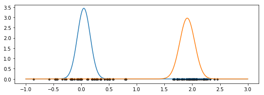


```python
# we can see that new Gaussians model the data much better!
```


```python
# let's see what happened to data-log likelihood and lower bound
# 

N1 = scipy.stats.norm(u[0], sigma[0])
N2 = scipy.stats.norm(u[1], sigma[1])

lower_bound = np.empty(x.shape[0])
for i, point in enumerate(x):
    lower_bound += R[i,0]*np.log(pi[0]*N1.pdf(x[i])/R[i,0]) + \
                      R[i,1]*np.log(pi[1]*N2.pdf(x[i])/R[i,1] )

```


```python
def get_lower_bound(x_arr, u_arr, sigma_arr, pi_arr, R):
    N1 = scipy.stats.norm(u_arr[0], sigma_arr[0])
    N2 = scipy.stats.norm(u_arr[1], sigma_arr[1])
    
    lower_bound = np.empty(100) # because we are varying 100 values for one of the Gaussian parameters
    for i, point in enumerate(x_arr):
        #log_likelihood += np.log(pi_arr[0]*N1.pdf(x_arr[i])+pi_arr[1]*N2.pdf(x_arr[i]))
        if (R[i,1]<0.0001):
            lower_bound += R[i,0]*np.log(pi_arr[0]*N1.pdf(x_arr[i])/R[i,0]) 
            
        elif (R[i,0]<0.0001):
            lower_bound += R[i,1]*np.log(pi_arr[1]*N2.pdf(x_arr[i])/R[i,1] ) 
            
        else:
           
            lower_bound += R[i,0]*np.log(pi_arr[0]*N1.pdf(x_arr[i])/R[i,0]) + R[i,1]*np.log(pi_arr[1]*N2.pdf(x_arr[i])/R[i,1] )
        
    return lower_bound
```


```python
R[i,0]*np.log(pi[0]*N1.pdf(x[i])/R[i,0]) + R[i,1]*np.log(pi[1]*N2.pdf(x[i])/R[i,1])
```


    0.4585876544713585


```python
print('u_old=',u_old,' u_new=', u[0])
mu = np.linspace(-2, 5, 100)
plt.plot(mu, get_lower_bound(x, np.array((u_old[0], mu)), sigma, pi, R), '--', color='salmon')
```

    u_old= [[0.08000243]
     [1.14667988]]  u_new= 0.04605771482846506


    [<matplotlib.lines.Line2D at 0x1131424a8>]


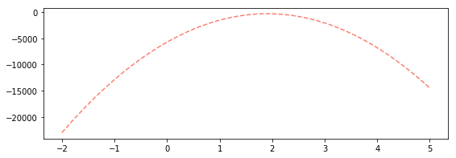


```python
for mm in [-2,-1,0,1,2,3]:
    print(mm, get_lower_bound(x, np.array((u_old[0], mm)), sigma, pi, R))
```

    -2 [-23387.48205601 -23372.43950021 -23357.67247835 -23343.18099042
     -23328.96503641 -23315.02461635 -23301.35973021 -23287.970378
     -23274.85655973 -23262.01827539 -23249.45552497 -23237.1683085
     -23225.15662595 -23213.42047733 -23201.95986265 -23190.7747819
     -23179.86523508 -23169.23122219 -23158.87274323 -23148.7897982
     -23138.98238711 -23129.45050995 -23120.19416672 -23111.21335742
     -23102.50808205 -23094.07834062 -23085.92413312 -23078.04545954
     -23070.4423199  -23063.1147142  -23056.06264242 -23049.28610457
     -23042.78510066 -23036.55963068 -23030.60969463 -23024.93529251
     -23019.53642432 -23014.41309007 -23009.56528975 -23004.99302336
     -23000.6962909  -22996.67509237 -22992.92942777 -22989.45929711
     -22986.26470038 -22983.34563757 -22980.70210871 -22978.33411377
     -22976.24165276 -22974.42472569 -22972.88333254 -22971.61747333
     -22970.62714806 -22969.91235671 -22969.47309929 -22969.30937581
     -22969.42118626 -22969.80853064 -22970.47140895 -22971.40982119
     -22972.62376736 -22974.11324747 -22975.87826151 -22977.91880948
     -22980.23489138 -22982.82650721 -22985.69365698 -22988.83634067
     -22992.2545583  -22995.94830986 -22999.91759535 -23004.16241478
     -23008.68276813 -23013.47865542 -23018.55007664 -23023.89703179
     -23029.51952087 -23035.41754388 -23041.59110083 -23048.04019171
     -23054.76481651 -23061.76497525 -23069.04066793 -23076.59189453
     -23084.41865507 -23092.52094953 -23100.89877793 -23109.55214026
     -23118.48103653 -23127.68546672 -23137.16543085 -23146.9209289
     -23156.95196089 -23167.25852681 -23177.84062667 -23188.69826045
     -23199.83142817 -23211.24012981 -23222.92436539 -23234.8841349 ]
    -1 [-36266.63274515 -36251.59018936 -36236.82316749 -36222.33167956
     -36208.11572556 -36194.17530549 -36180.51041935 -36167.12106714
     -36154.00724887 -36141.16896453 -36128.60621412 -36116.31899764
     -36104.30731509 -36092.57116648 -36081.11055179 -36069.92547104
     -36059.01592422 -36048.38191133 -36038.02343237 -36027.94048735
     -36018.13307625 -36008.60119909 -35999.34485586 -35990.36404656
     -35981.6587712  -35973.22902976 -35965.07482226 -35957.19614869
     -35949.59300905 -35942.26540334 -35935.21333156 -35928.43679372
     -35921.9357898  -35915.71031982 -35909.76038377 -35904.08598165
     -35898.68711347 -35893.56377921 -35888.71597889 -35884.1437125
     -35879.84698004 -35875.82578151 -35872.08011692 -35868.60998625
     -35865.41538952 -35862.49632672 -35859.85279785 -35857.48480291
     -35855.3923419  -35853.57541483 -35852.03402169 -35850.76816248
     -35849.7778372  -35849.06304585 -35848.62378843 -35848.46006495
     -35848.5718754  -35848.95921978 -35849.62209809 -35850.56051033
     -35851.77445651 -35853.26393661 -35855.02895065 -35857.06949862
     -35859.38558052 -35861.97719636 -35864.84434612 -35867.98702982
     -35871.40524745 -35875.09899901 -35879.0682845  -35883.31310392
     -35887.83345728 -35892.62934456 -35897.70076578 -35903.04772093
     -35908.67021001 -35914.56823303 -35920.74178997 -35927.19088085
     -35933.91550566 -35940.9156644  -35948.19135707 -35955.74258367
     -35963.56934421 -35971.67163868 -35980.04946708 -35988.70282941
     -35997.63172567 -36006.83615586 -36016.31611999 -36026.07161805
     -36036.10265003 -36046.40921596 -36056.99131581 -36067.84894959
     -36078.98211731 -36090.39081896 -36102.07505454 -36114.03482405]
    0 [-42014.67722927 -41999.63467347 -41984.86765161 -41970.37616368
     -41956.16020968 -41942.21978961 -41928.55490347 -41915.16555126
     -41902.05173299 -41889.21344865 -41876.65069824 -41864.36348176
     -41852.35179921 -41840.61565059 -41829.15503591 -41817.96995516
     -41807.06040834 -41796.42639545 -41786.06791649 -41775.98497147
     -41766.17756037 -41756.64568321 -41747.38933998 -41738.40853068
     -41729.70325532 -41721.27351388 -41713.11930638 -41705.24063281
     -41697.63749317 -41690.30988746 -41683.25781568 -41676.48127784
     -41669.98027392 -41663.75480394 -41657.80486789 -41652.13046577
     -41646.73159759 -41641.60826333 -41636.76046301 -41632.18819662
     -41627.89146416 -41623.87026563 -41620.12460103 -41616.65447037
     -41613.45987364 -41610.54081084 -41607.89728197 -41605.52928703
     -41603.43682602 -41601.61989895 -41600.07850581 -41598.8126466
     -41597.82232132 -41597.10752997 -41596.66827255 -41596.50454907
     -41596.61635952 -41597.0037039  -41597.66658221 -41598.60499445
     -41599.81894063 -41601.30842073 -41603.07343477 -41605.11398274
     -41607.43006464 -41610.02168047 -41612.88883024 -41616.03151394
     -41619.44973156 -41623.14348312 -41627.11276862 -41631.35758804
     -41635.87794139 -41640.67382868 -41645.7452499  -41651.09220505
     -41656.71469413 -41662.61271715 -41668.78627409 -41675.23536497
     -41681.95998978 -41688.96014852 -41696.23584119 -41703.78706779
     -41711.61382833 -41719.7161228  -41728.09395119 -41736.74731353
     -41745.67620979 -41754.88063998 -41764.36060411 -41774.11610216
     -41784.14713415 -41794.45370007 -41805.03579993 -41815.89343371
     -41827.02660143 -41838.43530308 -41850.11953865 -41862.07930817]
    1 [-43591.13075453 -43576.08819874 -43561.32117687 -43546.82968894
     -43532.61373494 -43518.67331487 -43505.00842873 -43491.61907653
     -43478.50525825 -43465.66697391 -43453.1042235  -43440.81700702
     -43428.80532447 -43417.06917586 -43405.60856117 -43394.42348042
     -43383.5139336  -43372.87992071 -43362.52144175 -43352.43849673
     -43342.63108564 -43333.09920847 -43323.84286524 -43314.86205594
     -43306.15678058 -43297.72703914 -43289.57283164 -43281.69415807
     -43274.09101843 -43266.76341272 -43259.71134094 -43252.9348031
     -43246.43379918 -43240.2083292  -43234.25839315 -43228.58399104
     -43223.18512285 -43218.06178859 -43213.21398827 -43208.64172188
     -43204.34498942 -43200.32379089 -43196.5781263  -43193.10799563
     -43189.9133989  -43186.9943361  -43184.35080723 -43181.98281229
     -43179.89035129 -43178.07342421 -43176.53203107 -43175.26617186
     -43174.27584658 -43173.56105523 -43173.12179782 -43172.95807433
     -43173.06988478 -43173.45722916 -43174.12010747 -43175.05851971
     -43176.27246589 -43177.76194599 -43179.52696003 -43181.567508
     -43183.8835899  -43186.47520574 -43189.3423555  -43192.4850392
     -43195.90325683 -43199.59700839 -43203.56629388 -43207.8111133
     -43212.33146666 -43217.12735394 -43222.19877516 -43227.54573031
     -43233.16821939 -43239.06624241 -43245.23979935 -43251.68889023
     -43258.41351504 -43265.41367378 -43272.68936645 -43280.24059306
     -43288.06735359 -43296.16964806 -43304.54747646 -43313.20083879
     -43322.12973505 -43331.33416524 -43340.81412937 -43350.56962743
     -43360.60065942 -43370.90722534 -43381.48932519 -43392.34695897
     -43403.48012669 -43414.88882834 -43426.57306392 -43438.53283343]
    2 [-43955.50856711 -43940.46601131 -43925.69898945 -43911.20750151
     -43896.99154751 -43883.05112744 -43869.3862413  -43855.9968891
     -43842.88307082 -43830.04478648 -43817.48203607 -43805.19481959
     -43793.18313705 -43781.44698843 -43769.98637375 -43758.80129299
     -43747.89174617 -43737.25773328 -43726.89925433 -43716.8163093
     -43707.00889821 -43697.47702105 -43688.22067782 -43679.23986852
     -43670.53459315 -43662.10485172 -43653.95064421 -43646.07197064
     -43638.468831   -43631.14122529 -43624.08915352 -43617.31261567
     -43610.81161176 -43604.58614178 -43598.63620573 -43592.96180361
     -43587.56293542 -43582.43960117 -43577.59180084 -43573.01953445
     -43568.72280199 -43564.70160347 -43560.95593887 -43557.48580821
     -43554.29121147 -43551.37214867 -43548.7286198  -43546.36062486
     -43544.26816386 -43542.45123678 -43540.90984364 -43539.64398443
     -43538.65365915 -43537.93886781 -43537.49961039 -43537.33588691
     -43537.44769735 -43537.83504173 -43538.49792004 -43539.43633229
     -43540.65027846 -43542.13975857 -43543.90477261 -43545.94532058
     -43548.26140248 -43550.85301831 -43553.72016807 -43556.86285177
     -43560.2810694  -43563.97482096 -43567.94410645 -43572.18892587
     -43576.70927923 -43581.50516652 -43586.57658773 -43591.92354289
     -43597.54603197 -43603.44405498 -43609.61761193 -43616.0667028
     -43622.79132761 -43629.79148635 -43637.06717902 -43644.61840563
     -43652.44516616 -43660.54746063 -43668.92528903 -43677.57865136
     -43686.50754762 -43695.71197782 -43705.19194194 -43714.94744
     -43724.97847199 -43735.28503791 -43745.86713776 -43756.72477155
     -43767.85793926 -43779.26664091 -43790.95087649 -43802.910646  ]
    3 [-46067.32591316 -46052.28335736 -46037.5163355  -46023.02484756
     -46008.80889356 -45994.86847349 -45981.20358736 -45967.81423515
     -45954.70041688 -45941.86213253 -45929.29938212 -45917.01216564
     -45905.0004831  -45893.26433448 -45881.8037198  -45870.61863904
     -45859.70909222 -45849.07507933 -45838.71660038 -45828.63365535
     -45818.82624426 -45809.2943671  -45800.03802387 -45791.05721457
     -45782.3519392  -45773.92219777 -45765.76799026 -45757.88931669
     -45750.28617705 -45742.95857134 -45735.90649957 -45729.12996172
     -45722.62895781 -45716.40348783 -45710.45355178 -45704.77914966
     -45699.38028147 -45694.25694722 -45689.40914689 -45684.8368805
     -45680.54014804 -45676.51894952 -45672.77328492 -45669.30315426
     -45666.10855752 -45663.18949472 -45660.54596585 -45658.17797091
     -45656.08550991 -45654.26858283 -45652.72718969 -45651.46133048
     -45650.4710052  -45649.75621386 -45649.31695644 -45649.15323296
     -45649.2650434  -45649.65238778 -45650.31526609 -45651.25367834
     -45652.46762451 -45653.95710462 -45655.72211866 -45657.76266663
     -45660.07874853 -45662.67036436 -45665.53751413 -45668.68019782
     -45672.09841545 -45675.79216701 -45679.7614525  -45684.00627192
     -45688.52662528 -45693.32251257 -45698.39393379 -45703.74088894
     -45709.36337802 -45715.26140103 -45721.43495798 -45727.88404885
     -45734.60867366 -45741.6088324  -45748.88452507 -45756.43575168
     -45764.26251221 -45772.36480668 -45780.74263508 -45789.39599741
     -45798.32489367 -45807.52932387 -45817.00928799 -45826.76478605
     -45836.79581804 -45847.10238396 -45857.68448381 -45868.5421176
     -45879.67528531 -45891.08398696 -45902.76822254 -45914.72799205]


```python
mu = np.linspace(-2, 5, 100)
# plot log-likelihood with old parameter values, u2 is varied
plt.plot(mu, get_log_likelihood(x, np.array((u_old[0], mu)), sigma_old, pi_old), color='deeppink')
# plot lower bound estimate with old parameter values, u2 is varied
plt.plot(mu, get_lower_bound(x, np.array((u_old[0], mu)), sigma_old, pi_old, R), '--', color='salmon')
plt.xlabel('2nd Gaussian mean')
plt.ylabel('Data log-likelihood')

# now let's look at how our parameters have been updated
lower_bound = get_lower_bound(x, np.array((u_old[0], mu)), sigma_old, pi_old, R)

# u2_max = u2 value that maximizes lower bound
mu_max = mu[ np.argmax(lower_bound) ]
# log-likelihood value at u2_max
max_l = get_log_likelihood(x, np.array((u_old[0], mu_max)), sigma_old, pi_old)

# log-likelihood value with old parameters 
old_l = get_log_likelihood(x, np.array((u_old[0], u_old[1])), sigma_old, pi_old)

# log-likelihood value with new parameters 
new_l = get_log_likelihood(x, np.array((u_old[0], u[1])), sigma_old, pi_old)

plt.scatter(u_old[1], old_l, color='black', marker='x', s=64, zorder=10)
plt.scatter(mu_max, max_l, color='black', marker='x', s=64, zorder=10)
plt.scatter(u[1], new_l, color='red', marker='x', s=64, zorder=10)
```


    <matplotlib.collections.PathCollection at 0x112f21b38>


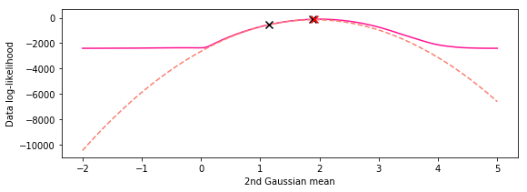


```python
# now let's add to our plot updated lower bound and log-likelihood functions
# plot previous plot
plt.plot(mu, get_log_likelihood(x, np.array((u_old[0], mu)), sigma_old, pi_old), color='deeppink')
plt.plot(mu, get_lower_bound(x, np.array((u_old[0], mu)), sigma_old, pi_old, R), '--', color='salmon')
plt.scatter(u_old[1], old_l, color='black', marker='x', s=64, zorder=10)
#plt.scatter(mu_max, max_l, color='black', marker='x', s=64)
#plt.scatter(u[1], new_l, color='red', marker='x', s=64)

# plot new functions
plt.plot(mu, get_log_likelihood(x, np.array((u[0], mu)), sigma, pi), color='royalblue')
plt.plot(mu, get_lower_bound(x, np.array((u[0], mu)), sigma, pi, R), '--', color='cornflowerblue')
new_l = get_log_likelihood(x, np.array((u[0], u[1])), sigma, pi)
plt.scatter(u[1], new_l, color='red', marker='x', s=64, zorder=10)

plt.xlabel('2nd Gaussian mean')
plt.ylabel('Data log-likelihood')
```


    Text(0, 0.5, 'Data log-likelihood')


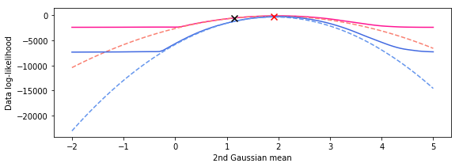

